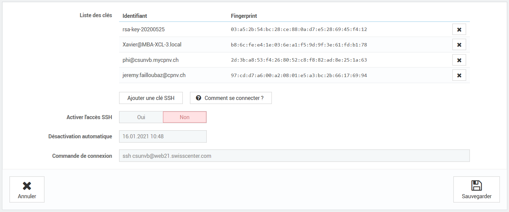

# Documentation Déploiement
## Authentification
Pour accéder à la page d’administration du site, se rendre sur :
https://apanel.swisscenter.com/
Donnée d’authentification :
Username : csunvb
Password : CSUPa$$w0rd

Attention le username est aussi sensible à la casse !

## Mise à jour du site
Pour le mise à jour du site nous utilisons une connexion en ssh. Pour ce faire il faut générer une paire de clés (public et privée).

### ajout d'une clef

Marche à suivre pour la génération des clés [ici](https://support.swisscenter.com/kb/a127/generer-ses-clefs-ssh-et-se-connecter.aspx).
 Depuis le tableau de bord sélectionnez l’onglet « ssh ». L’interface suivant devrait apparaître



Il faudra ensuite ajouter une nouvelle clé, et entrer la clé publique que vous avez générée au préalable.

### Connection

Ensuite, il faut activer l’accès SSH dans le tableau de bord. 
Vous pouvez ensuite vous connecter en ssh avec votre clef.
Le login qu’il faudra entrer : csunvb

### mise a jour du site
Le dossier git du site se trouve dans le dossier home de l’utilisateur. Nous allons donc y naviguer:
```
Cd /home/csunvb/csunvb.mycpnv.ch/CSUNVB
```

Ensuite nous changeons de branche (si nécessaire) et nous mettons à jour avec le dépôt :
```
Git checkout <branche>
Git pull
```
