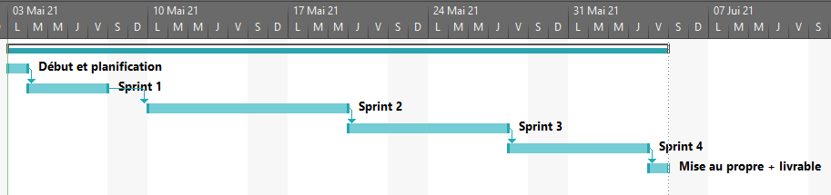

# Bilan Théo Gautier

## Planification initiale

| Sprint | Début | Fin | Contenu | 
| ---- | ---- | ---- | --- | --- |
| Début et planification | 03/05/2021 | 03/05/2021 | - Procédure de début de TPI et Planification |
| Sprint 1 | 04/05/2021 | 07/05/2021 | - Sortir une ampoule de la pharmacie |
| Sprint 2 | 10/05/2021 | 19/05/2021 | - Disposer des statistiques d'usage sous forme de tableau croisé dynamique  - Premier rendez vous avec le CSUNVB | 
| Sprint 3 | 20/05/2021 | 27/05/2021 | - Obtenir un token d'authentification  - Obtenir la liste des bases  - Obtenir la liste des rapports  - Second rendez vous avec le CSUNVB |
| Sprint 4 | 28/05/2021 | 03/06/2021 | - Obtenir la liste des actions  - Obtenir la liste des contrôles manquants  - Reporter une valeur de contrôle |
|  Mise au propre + livrable final | 04/06/2021 | 04/06/2021 | - Mise au propre et préparation du livrable final |

## Journal de bord

Ce journal est une copie du journal présent sur Icescrum. Il est ordré du plus récent au plus ancien.

| Personne et date | Entrée du journal |
| --- | --- |
| XCL 05.05.2021 | Ajout de la spécification détaillée de l'API dans le repository (doc/CSUNVB API.pdf) |
| TGR 04.05.2021 | Après avoir fait une planification initiale et avoir pris connaissance de l'ampleur du travail à effectuer et des spécificités de chaque taches, j'ai le sentiment qu'effectuer le cahier des charges dans on entièreté sera difficile dans les 90 heures du TPI.   Pour cette raison, j'ai contacté mon chef de projet et nous avons eu une réunion rapide pour faire le point sur les questions que j'avais et le faite que je ne pense pas pouvoir finir tout le cahier des charges dans le temps imparti.   Nous avons donc décidé de revoir l'ordre dans lequel j'effectuerais les taches afin de faire le plus important d'abord. L'ordre dans lequel sera effectué les taches est donc:  l'API puis ensuite la sortie de stupéfiants de la pharmatie et pour finir les statistiques |
| TGR 03.05.2021 | Début du TPI |

