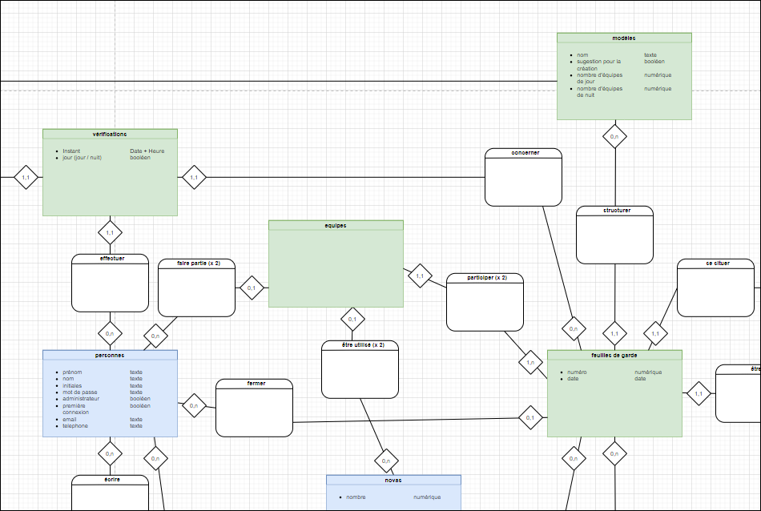
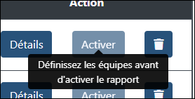
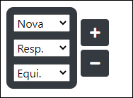
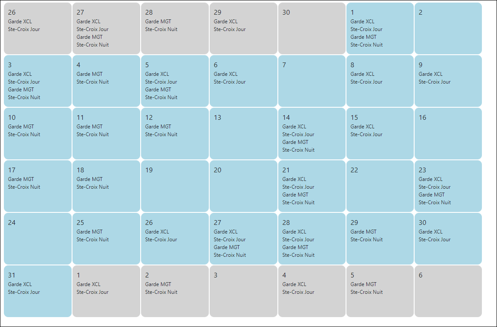
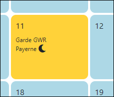
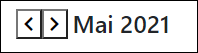
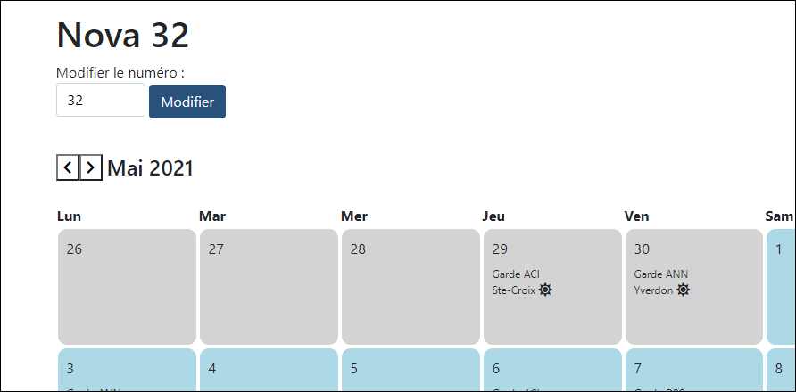

# Rapport de Projet TPI - Michael Gogniat : CSUNVB

## Planification initiale

Le projet se déroulera de manière agile en 4 sprint

### Sprint 1 : Multi-équipe

Date : 03/05/2021 - 10/05/2021

Review : 10/05/2021 09:00, salle selon disponibilité à convenir avec M. Carrel

Objetif(s) :

Il est possible d'ajouter/supprimer une équipe (composée d'un responsable, d'un équipier et d'une nova) sur un rapport de garde afin d'un avoir plusieurs pour le même créneau.

### Sprint 2 : Planning des secouristes (-> sprint 3)

Date : 10/05/2021 - 18/05/2021

Review : 18/05/2021 15:30, salle selon disponibilité à convenir avec M. Carrel

Objetif(s) :

Importation du planning des secouriste depuis un fichier CSV. 
Le Planning est visible par les administrateurs depuis la page Administration > secouriste

### Sprint 3 : Gestion des secouristes sur les rapports de garde (-> sprint 4)

Date : 19/05/2021 - 25/05/2021

Review : 25/05/2021 15:30, salle selon disponibilité à convenir avec M. Carrel

Objetif(s) :

Seulement les secouristes présents sur la base pour le jour en question sont proposé lors du choix d'équipes sur un rapport de garde.
Les secouristes ne faisant pas partie d'une équipe ne peuvent plus remplir un rapport de garde.
Seul les secouristes mentionnés sur le rapport si celui-ci est récent (3 jour) et les administrateurs peuvent corriger un rapport.

### Sprint 4 : Gestion de l'utilisation des novas (-> sprint 2)

Date : 26/05/2021 - 02/06/2021

Review : 01/06/2021 15:30, salle selon disponibilité à convenir avec M. Carrel 

Objetif(s) :

La page administration > novas permet de voir l'utilisation des novas par les gardes
Un administrateur peut réserver une nova pour indiquer qu'elle ne sera pas disponible

## Multi-équipe(garde)

Certaines bases possèdent plusieurs équipes de soucouriste pour le jour ou la nuit, il est donc important de pouvoir les incricre sur le rapport.

Même si 2 équipes sont présentes pour assurer la garde, un seul rapport sera gérer, car c'est actuellement leur méthode de travail sur papier.

Un bouton + de la même couleur que le créneau (bleu/noir) devra présent à côté de celui ci pour ajouter une équipe

Un boutons supprimer ne sera présent que si il y a 2 équipes ou plus car il n'est pas possible de ne pas en avoir pour un créneau.

Le nombre d'équipes pour chaque créneaux doit être renseigné dans le modèle afin de pouvoir créer de nouveaux rapports identiques

La manière de renseigner les informations pour les équipes supplémentaires resteront identiques à la première (listes déroulantes)

#### Point importants à effectuer :

Modification de la base de donnée, ajout d'une table équipes ainsi que les attributs nombres d'équipes aux modèles selon le MCD suivant :

Pour activer un rapport il faut vérifier que toutes les informations de toutes les équipes doivent être enregistrées

Adapter le code php des page utilisant les informations des équipes :
- dashboard
- liste de rapport de garde
- détail d'un rapport

Pouvoir Ajouter/Supprimer une équipe et faire attention à ce que le header du rapport s'affiche correctement sur tablette même avec plusieurs équipes par créneau

### Conception et Fonctionnement

Aller voir les sections "" de de la documentation technique (pas encore documenté)

## Calendrier de nova (ambulance)

Le but du calendrier est de facilité aux utilisateurs le suivit de novas et de connâitre leurs futures utilisations.

Pour l'affichage de ce calendrier, un format classique par mois à été choisis pour une bonne vision de l'utilisation de la nova.

Les jours du mois seront en bleu clair (couleur principale du site), les jours du mois précédant et du mois suivant seront en gris

Les informations inportantes des gardes utilisant les novas sont affichées, à savoir :
- la base sur laquelle sera utilisée la nova
- Par qui elle sera utilisée
- Quand elle sera utilisée (créneau de jour ou de nuit)

Maquette (première version)

Après reflexion lors du développement, les modifications suivantes ont été effectuées :
- Le jour actuel est affiché en jaune
- Utilisation d'une icone pour l'indication Jour/Nuit, plus visible par l'utilisateur

Pour la sélection du mois, la première idée était d'ajouter un input de type "mois"

Mais finalement après discution avec M. Carrel, cette idée ne serait pas compatible avec certains navigateurs, l'idée retenue est donc de simples boutons flèches directionnelles pour afficher le mois précédant/suivant

Cette solution est simple à mettre en place et suffisante car les utilisateurs devraient se concentrer seulement sur "plusieurs jours ou semaines en avances" (Cahier de charges)

### Risque

Le formulaire de modification du nom de la nova déjà existant peut passer un champs qui sélectionne la nova dont on veut voir le calendrier si le secouriste n'est pas attentif.

Cette option ne sera que très peut utilisée car elle implique de nombreux changements (numéros iinscrits sur les novas, etc.), elle n'a donc pas besoin d'être affichée sur toute les pages de nova

Il serait intéressant de supprimer ce formaulaire et d'ajouter un icone "crayon" ouvrant un formulaire dans un popup afin de modifier le numéro d'une nova.

## Droits de modification (garde)

### Analyse

Les secoursites qui ne sont pas présents sur un rapport de garde ne devraient pas avoir le droits de le remplir

Il faut donc limiter les droits à : 

- Tous les secouristes des équipes mentionnées sur le rapport
- Les administrateurs

Pour la correction d'un rapport, il faut aussi que l'action soit possible que par les secouristes présents sur le rapport ou par un administrateur

Si le rapport date de plus de 3 jours, un simple secouriste n'aura plus les droits de le corriger (souhait du CSU)

## Objectif atteints/Non-atteints

## Analyse de risques

Si le serveur prend du temps à répondre, il est possible de cliquer plusieur fois sur le même boutons ce qui execute l'ation plusieurs fois, il pourrait être intéressant à therme de désactivé le boutons lorsqu'il est cliqué

Comme la page n'est pas en permanence rechargée, si un secouriste charge la page et qu'un deuxième effectue des actions entre-deux, le premier ne vera pas les modifications.
Une solution serait d'ajouter le champs date de dernière mofification sur les rapports ainsi qu'une fonction javascript (ajax), qui questionnerait le serveur afin de savoir si la page est à jour.
Le problème reste actuellement minime car chaque base possédera qu'une tablette permettant de remplir son rapport.

Une seule tablette sera présente par base pour remplir les rapports, il y aura donc un seul utilisateur connecté, pourtant plusieurs d'entre eux travailleront en même temps, il se peut donc que certaines données soient validées par un autre secouriste que celui qu'y s'est connecté au début de la garde
Le problème est de type humain et rien qui serait simple à mettre en place pour résoudre ce soucis.

## Document Fournis

Ce fichier comprend les points importants par rappport au TPI (reflexion, déroulement, etc.) mais pas les points techniques importants au projet.

Tous les autres documents peuvent être retrouvés sur le [GitHub](https://github.com/CPNV-INFO/CSUNVB/tree/MGT/Doc) public, sur la branche MGT, associée à mon TPI

Le fichier "Doc\Mapping Dossier de projet.docx" contient les directives un peu particulères à ce projet de TPI, et où on peut retrouver les différents éléments demandés.

Le fichier "Doc\documentation technique.md" explique le fonctionnement du site pour de potentiels futurs développeurs

Le fichier Doc\Gogniat\Journal_de_Travail.pdf, exporter depuis Icescrum et tenu à jour deux fois par semaine (mardi et jeudi)

Le fichier Doc\Gogniat\Journal_de_Test.pdf, exporter depuis Icescrum, il liste les différents test de validation, il est tenu à jour à chaque fin de sprint

Document physique ? à discuter avec les experts

## Conclusion

## Sources / Aides

Xavier Carrel, chef de projet et conseils

Besjan Sejrani (collègue), avis sur le design du site

[Behance](https://www.behance.net/) : Recherche d'idée graphique

[W3schools](https://www.w3schools.com/css/) : Aide et rappel CSS

[PHP.net](https://www.php.net/) : Manuel PHP

